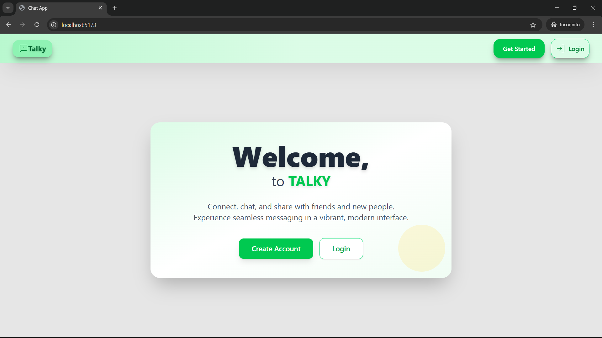
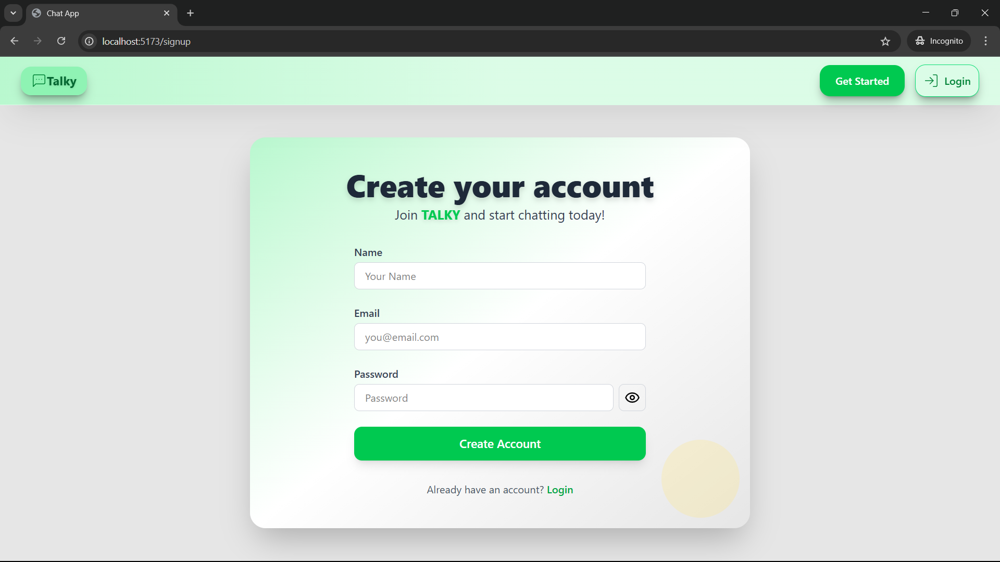
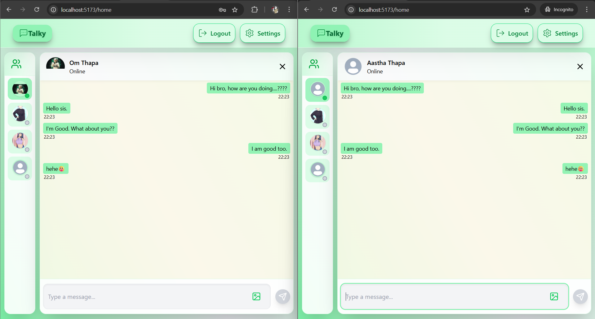
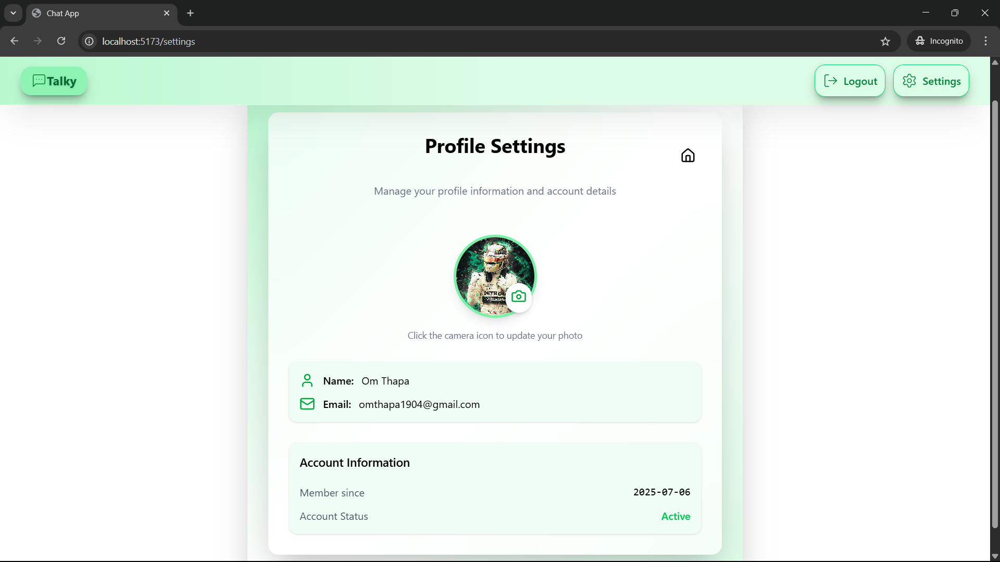

# 💬 Real-Time Chat Application

A real-time chat application built with **React**, **Socket.IO**, and **MongoDB**. This project demonstrates full-stack real-time communication using modern technologies including React (with Vite), Zustand for state management, Express.js, and Socket.IO for WebSocket communication.

## 🚀 Features

- Real-time messaging using WebSockets
- Authentication with JSON Web Tokens (JWT)
- File/image upload support via Cloudinary
- Responsive and sleek UI with TailwindCSS
- Global state management using Zustand
- Modern frontend tooling with Vite
- Protected routes with React Router

---

## 🛠️ Tech Stack

### Frontend:
- React
- Vite
- React Router
- Zustand
- Axios
- TailwindCSS
- socket.io-client

### Backend:
- Node.js & Express
- MongoDB & Mongoose
- socket.io
- JSON Web Tokens (jsonwebtoken)
- Cloudinary (for file/image uploads)

---

## 🗂️ Project Structure

```
Chat-App/
  ├── client/      # React frontend (Vite)
  ├── server/      # Express backend
  └──  README.md
```

## 📦 Installation & Setup

### 1. Clone the Repository

```bash
git clone https://github.com/Om-Thapa/Chat-App.git
cd Chat-App
```
### 2. Build the application

```shell
npm run build
```

### 3. 🔐 Setup .env file

- **Backend:** Create a `.env` file in `/server` with:

```js
MONGODB_URI=your_mongodb_connection_string
PORT=5000
JWT_SECRET=your_jwt_secret
CLOUDINARY_CLOUD_NAME=your_cloudinary_cloud_name
CLOUDINARY_API_KEY=your_cloudinary_api_key
CLOUDINARY_API_SECRET=your_cloudinary_api_secret
```

### 4. 🚴 Running the Application

## Backend(Server):

```bash
cd server
npm run dev
```

## Frontend(Client):

```bash
cd server
npm run dev
```

## 🖼️ Screenshots

<p align="center">
  
  
  
  
  
</p>

Maybe will add a friend-list feature in future.

## 🤝 Contributing

Pull requests are welcome! For major changes, please open an issue first to discuss what you would like to change